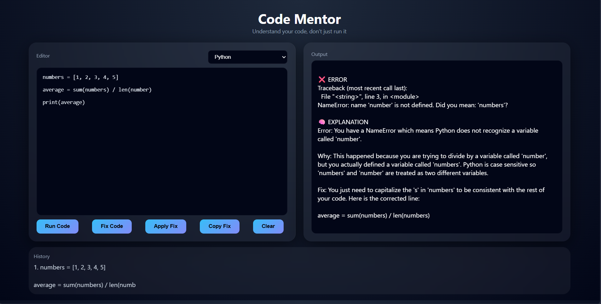
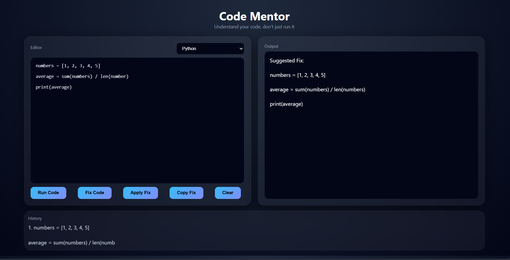

#  Code Mentor

Code Mentor is an AI-powered Python debugging assistant that helps users understand, run, debug, and fix Python code directly from the browser.

Instead of simply displaying errors, Code Mentor explains mistakes in beginner-friendly language and suggests corrected code using AI.

---

##  Features

###  Run Python Code
Execute Python code instantly using a FastAPI backend.

### AI Error Explanation
When an error occurs, Code Mentor explains:

- What went wrong
- Why it happened
- How to fix it

The explanations are generated using AI and written in simple language suitable for beginners.

###  AI Code Fixing
Automatically generates corrected Python code for common syntax, runtime, and logical errors.

###  Copy Fix
Copy the suggested fix with a single click.

### Apply Fix
Replace the current code with the AI-generated fix instantly.

###  Code History
Stores recently executed code snippets for quick reference.

###  Modern User Interface
Clean dark-themed interface inspired by modern developer tools.

---

##  Project Preview

### Main Features

- Code Editor
- Error Detection
- AI Explanation
- AI Fix Suggestions
- Code History

---

## Architecture

Frontend (HTML, CSS, JavaScript)
        ↓
FastAPI Backend
        ↓
Python Execution Engine
        ↓
Groq LLM API
        ↓
AI Explanation & Code Fixing

---

##  Tech Stack

### Frontend
- HTML5
- CSS3
- JavaScript

### Backend
- FastAPI
- Python 

### AI Integration
- Groq API
- Llama 3.1 8B Instant

### Other Libraries
- Pydantic
- Uvicorn
- FastAPI CORS Middleware

---

## Project Structure


code-mentor/
│
├── main.py
├── index.html
├── requirements.txt
├── README.md
├── .gitignore
│
├── venv/
└── __pycache__/


## ⚙ Installation

### Clone Repository

```bash
git clone https://github.com/yourusername/CODE-MENTOR.git
cd code-mentor
```

### Create Virtual Environment

```bash
python -m venv venv
```

### Activate Environment

Windows:

```bash
venv\Scripts\activate
```

### Install Dependencies

```bash
pip install -r requirements.txt
```

### Create Environment Variable

Create a `.env` file:

```env
GROQ_API_KEY=your_api_key_here
```

### Run Backend

```bash
python -m uvicorn main:app --reload
```

### Run Frontend

Open:

```text
index.html
```

or run with VS Code Live Server.

---

##  Future Improvements

- Multi-language support (Java, C++, JavaScript)
- Monaco Editor Integration
- Syntax Highlighting
- Download Fixed Code
- Save Projects
- Authentication System
- Cloud Deployment
- AI Code Review
- Code Complexity Analysis

---

## Project Preview

### Home Screen


### Error Explanation


### AI Fix Suggestion


## Author

Diti Ahuja

Aspiring Software Developer | Python Developer | AI & ML Enthusiast

---

##  Motivation

The goal of Code Mentor is not only to fix code but also to help users learn from their mistakes by providing simple explanations and actionable fixes.

"Understand your code, don't just run it."
